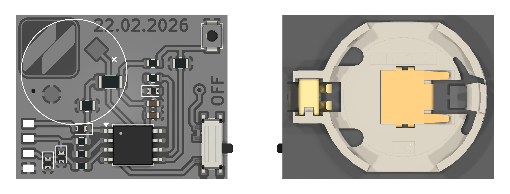

# ATtiny85 Cricket

  

---

## Overview
This project implements a simple audio generator on an ATtiny85 using Timer0 hardware PWM. The firmware drives a piezo output with dynamically modified duty cycles and timing patterns to produce non-periodic, insect-like audio noise.

## Hardware
The circuit is built around an ATtiny85 microcontroller powered directly from a battery. The design is minimal and relies on driving a buzzer directly from the PWM pin, without using a dedicated DAC or any additional analog signal conditioning stage.

## Firmware
Firmware generates a random number to select one of four possible cricket sound patterns. After a pattern is executed, another random value is generated in the range of 25 to 35, which determines the idle time in minutes during which the device does nothing and stays inactive. After this sleep-like dead time, the device wakes up, generates a new sound pattern, and the process repeats continuously.

## Sound
The sound is created by directly changing the PWM output value at irregular moments in time. The sound is a series of short, uneven state changes that together create a rough, insect-like chirping effect.

## Extensions
Sleep modes combined with interrupt-based wake-up can be used to shut the ATtiny85 down completely for long periods, such as around 30 minutes, while maintaining very low power consumption. The device can then wake up using a timer or external interrupt, run its sound routine, and return to sleep again. Based on an estimate, this approach could roughly double the battery life, resulting in around a month of operation depending on the power source and usage pattern.
